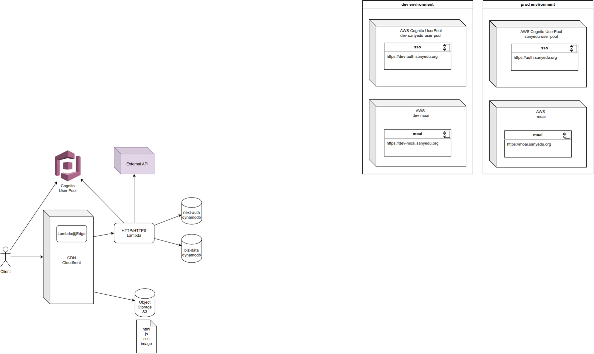

## Portal Site

### Dependencies

-   GNU Make for windows: https://github.com/mbuilov/gnumake-windows/
-   AWS CLI:
    https://docs.aws.amazon.com/cli/latest/userguide/getting-started-install.html
-   Docker for windows(needed by localstack):
    https://www.docker.com/products/docker-desktop/
-   localstack: https://docs.localstack.cloud/getting-started/installation/
-   Terraform: https://developer.hashicorp.com/terraform/install
-   tflocal: https://github.com/localstack/terraform-local

### Deploy

