# 在 Windows 下搭建开发环境

## 修复 windows 系统 DNS 域名解析问题

开始菜单中，使用管理员打开`notepad`记事本程序。

<QuizImgPaste id='test' title="完成任务并截图上传">
  <h1>xxx</h1>
  <p>yyy</p>
  <Code><Pre>{`public void main() {
    System.out.println("Hello, world!");
    System.out.println("Hello, world!");
} `}</Pre></Code>
</QuizImgPaste>

<Callout emoji="✅">
将要修改的文件是受Windows系统保护的，所以需要使用管理员权限打开记事本程序，才能在修改后保存文件。
</Callout>

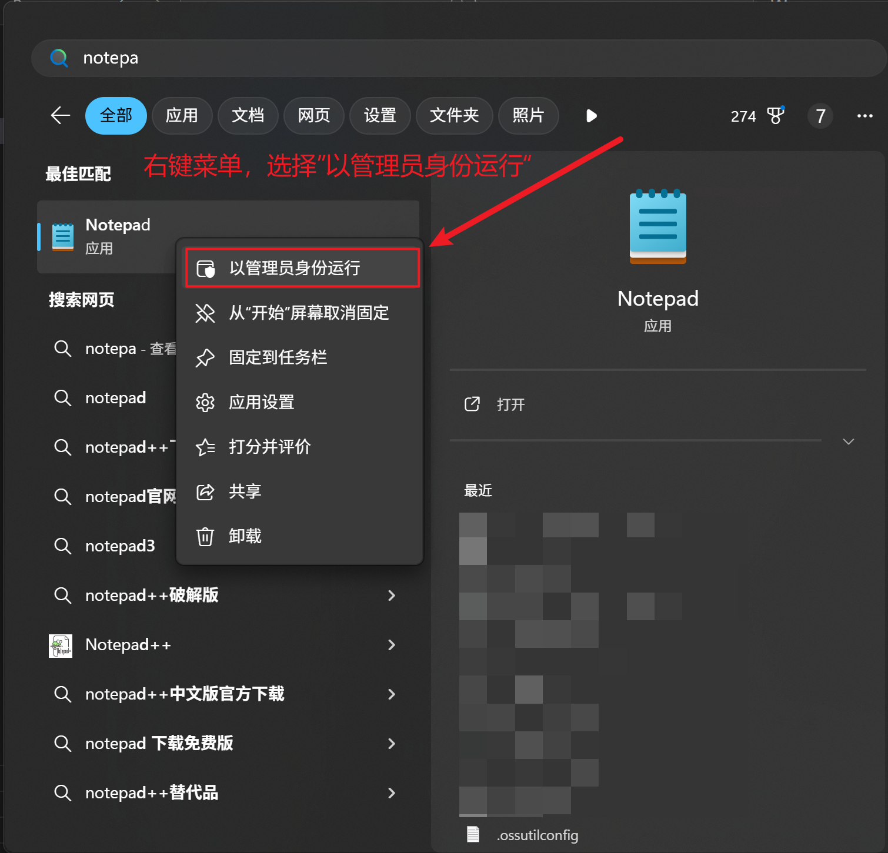

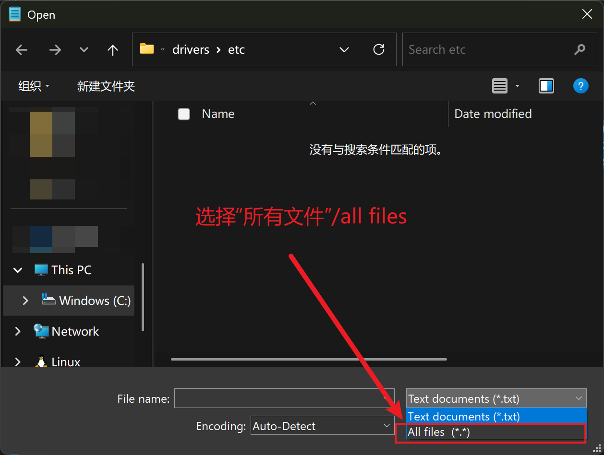

用记事本程序打开`C:\Windows\System32\drivers\etc\hosts`文件，在文件末尾添加以下内容：

```bash
# GitHub520 Host Start
140.82.114.25                 alive.github.com
20.205.243.168                api.github.com
140.82.114.21                 api.individual.githubcopilot.com
185.199.110.133               avatars.githubusercontent.com
185.199.110.133               avatars0.githubusercontent.com
185.199.110.133               avatars1.githubusercontent.com
185.199.110.133               avatars2.githubusercontent.com
185.199.110.133               avatars3.githubusercontent.com
185.199.110.133               avatars4.githubusercontent.com
185.199.110.133               avatars5.githubusercontent.com
185.199.110.133               camo.githubusercontent.com
140.82.112.22                 central.github.com
185.199.110.133               cloud.githubusercontent.com
20.205.243.165                codeload.github.com
140.82.113.22                 collector.github.com
185.199.110.133               desktop.githubusercontent.com
185.199.110.133               favicons.githubusercontent.com
20.205.243.166                gist.github.com
3.5.31.100                    github-cloud.s3.amazonaws.com
3.5.17.144                    github-com.s3.amazonaws.com
52.216.248.228                github-production-release-asset-2e65be.s3.amazonaws.com
52.216.53.217                 github-production-repository-file-5c1aeb.s3.amazonaws.com
54.231.137.241                github-production-user-asset-6210df.s3.amazonaws.com
192.0.66.2                    github.blog
20.205.243.166                github.com
140.82.114.17                 github.community
185.199.108.154               github.githubassets.com
151.101.193.194               github.global.ssl.fastly.net
185.199.111.153               github.io
185.199.110.133               github.map.fastly.net
185.199.111.153               githubstatus.com
140.82.112.26                 live.github.com
185.199.110.133               media.githubusercontent.com
185.199.110.133               objects.githubusercontent.com
13.107.42.16                  pipelines.actions.githubusercontent.com
185.199.110.133               raw.githubusercontent.com
185.199.110.133               user-images.githubusercontent.com
13.107.246.73                 vscode.dev
140.82.112.21                 education.github.com
185.199.110.133               private-user-images.githubusercontent.com


# Update time: 2025-04-16T08:28:05+08:00
# Update url: https://raw.hellogithub.com/hosts
# Star me: https://github.com/521xueweihan/GitHub520
# GitHub520 Host End
```

MacOS 系统修改 hosts 文件的方法：

```bash
sudo vi /etc/hosts
```

访问：https://github.com/

验证 DNS 解析修复是否成功。

参考：

-   https://github.com/521xueweihan/GitHub520

## 在 Windows 中启用 WSL

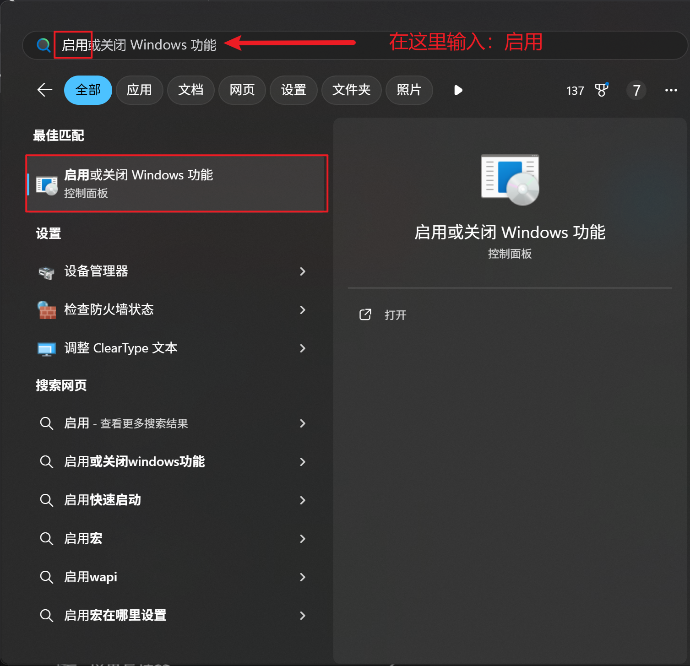

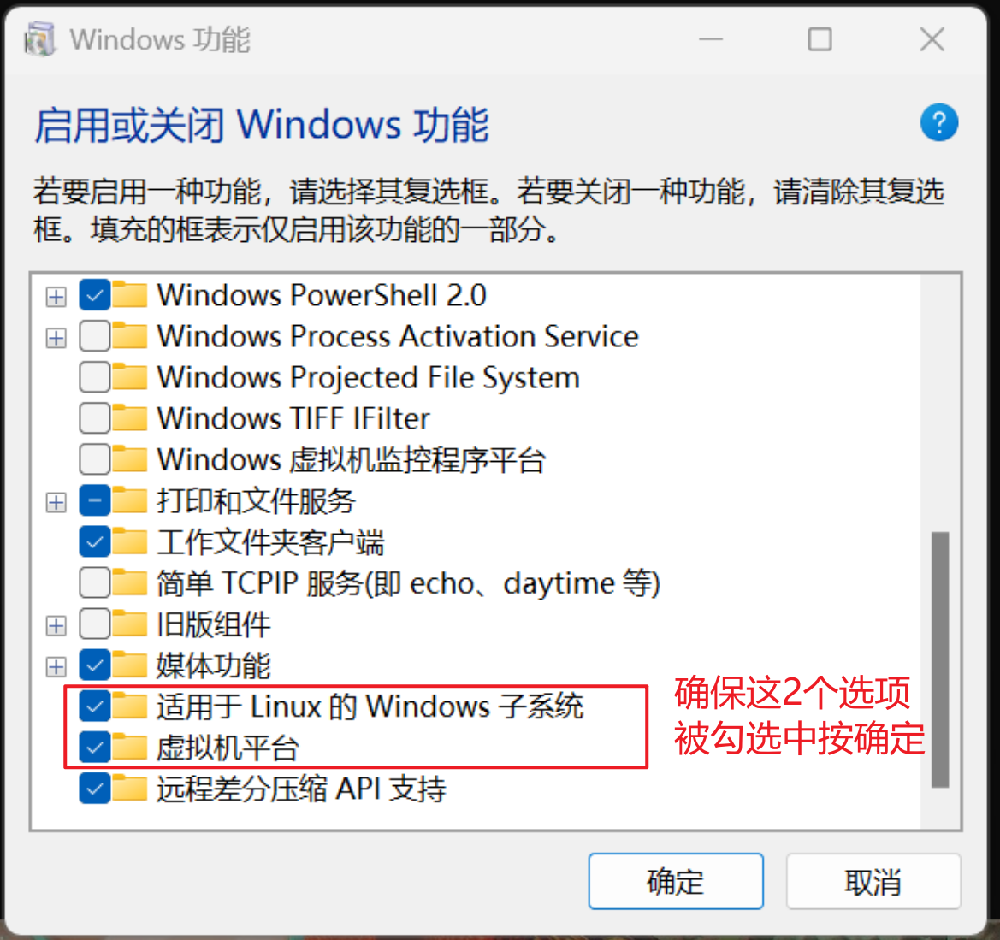

如果上面步骤安装不成功，也可以参考 Microsoft 文档，进行手动安装：

-   https://learn.microsoft.com/zh-cn/windows/wsl/install-manual

旧版 Win10 系统考虑安装最新版本的 Windows 终端（可选）

-   https://learn.microsoft.com/zh-cn/windows/terminal/install

## 更新 wsl 到版本 2

打开 cmd，输入以下命令：

```bash
wsl --update
```

等待更新完成，重启系统，重新启动 wsl。

```bash
# 重启wsl，或按提示重启系统
wsl --shutdown
```

## 安装 Ubuntu Linux

```
wsl --install
```

验证是否安装成功：

```
wsl -l -v
```

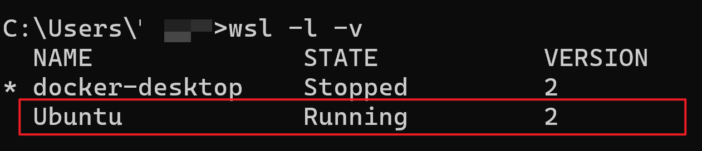

看到 Ubuntu 系统的版本号，说明安装成功。

将 Ubuntu 系统设置为 wsl 的默认启动版本：

```bash
wsl --set-default Ubuntu
```

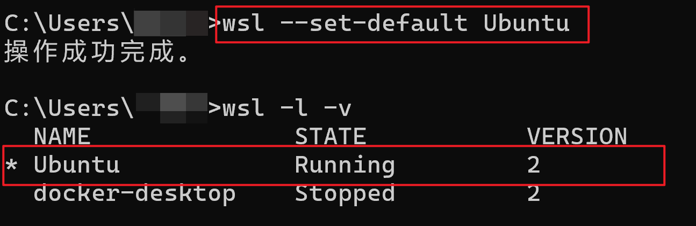

## 首次启动 Ubuntun Linux

```bash
wsl
```

或者

```bash
wsl -d Ubuntu
```

输入用户名和密码，按照提示进行操作。(注意：用户名和密码都不要使用中文)

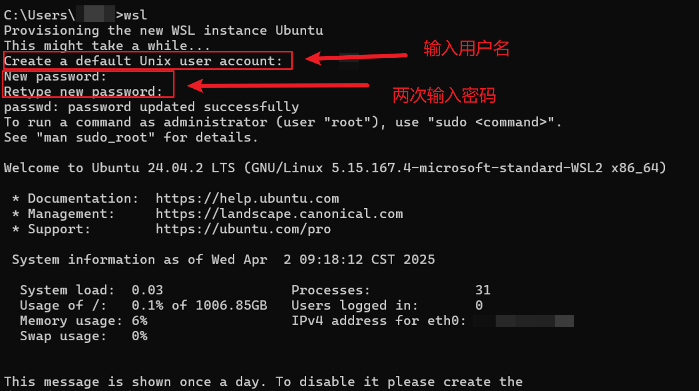

## 配置执行 sudo 命令时不需要输入密码

```bash
sudo visudo
# 输入管理员密码，以修改配置文件
```

找到`%sudo ALL=(ALL:ALL) ALL`这一行，将其修改为：`%sudo ALL=(ALL) NOPASSWD:ALL`

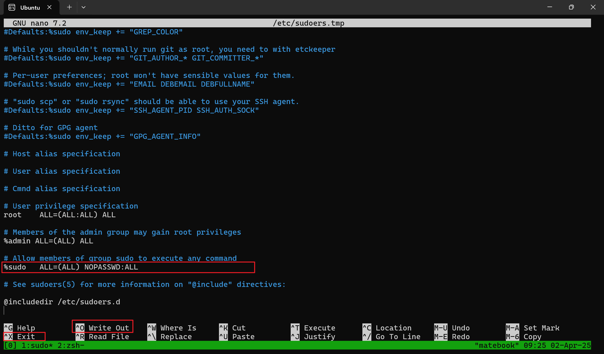

<Callout emoji="✅">
注意：
-   在 Linux 系统中，visudo 是一个用于安全编辑 /etc/sudoers 文件的命令。它会在保存时检查语法错误，防止因配置错误导致 sudo 不可用；
-   visudo默认会使用 nano 编辑器打开/etc/sudoers 文件，进行编辑，编辑器界面如上图所示；
-   在编辑器界面按 Ctrl+O 是保存。会先将修改保存到名为/etc/sudoers.tmp 的临时文件中，在这里只需按回车确定文件名即可，然后visudo 会对临时文件进行语法和安全检查。如果检查通过，自动将临时文件/etc/sudoers.tmp 文件重命名为/etc/sudoers，让配置修改生效；
-   保存生效以后，在编辑器界面按 Ctrl+X 退出编辑即可。
</Callout>

## 安装 zsh 与 tmux

```
sudo apt update
sudo apt install zsh tmux
```

使用 zsh 做为默认的 shell:

```
chsh -s /bin/zsh
```

## 修复 wsl Ubuntu 系统的 DNS 解析问题

```bash
sudo vi /etc/hosts
```

把上面“修复 Windows 系统 DNS 域名解析问题”中 Github520 中的域名解释数据粘贴到`/etc/hosts`文件的末尾，保存并退出。

## 安装 oh-my-zsh

[Better zsh: Oh My Zsh](https://ohmyz.sh/)

```bash
sh -c "$(curl -fsSL https://raw.githubusercontent.com/ohmyzsh/ohmyzsh/master/tools/install.sh)"
```

## 配置 tmux

```bash
vi ~/.tmux.conf
```

添加以下内容：

```bash
set -g base-index 1
setw -g mouse on

bind -Tcopy-mode MouseDragEnd1Pane send -X copy-selection-and-cancel\; run-shell -b "tmux show-buffer | /mnt/c/Windows/System32/clip.exe"

set-option -g history-limit 50000

bind c new-window -c "#{pane_current_path}"
bind '"' split-window -c "#{pane_current_path}"
bind % split-window -h -c "#{pane_current_path}"
```

## 配置.zshrc 文件启动 tmux

```bash
vi ~/.zshrc
```

将下面内容添加到文件末尾：

```bash
# 将~/bin加入到PATH环境变量中
export PATH=$HOME/bin:/usr/local/bin:$PATH

if command -v tmux &> /dev/null && [ -n "$PS1" ] && [[ ! "$TERM" =~ screen ]] && [[ ! "$TERM" =~ tmux ]] && [ -z "$TMUX" ]; then
  exec tmux
fi
```

重新加载配置文件：

```bash
source ~/.zshrc
```

或者重启 wsl 让配置生效。

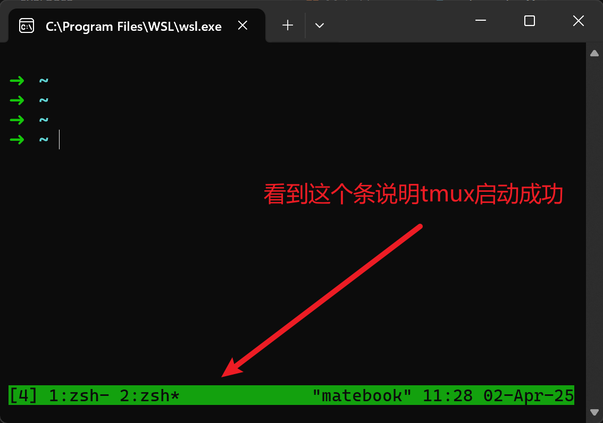

tmux 基本操作，熟悉基本的窗口操作就够用了：

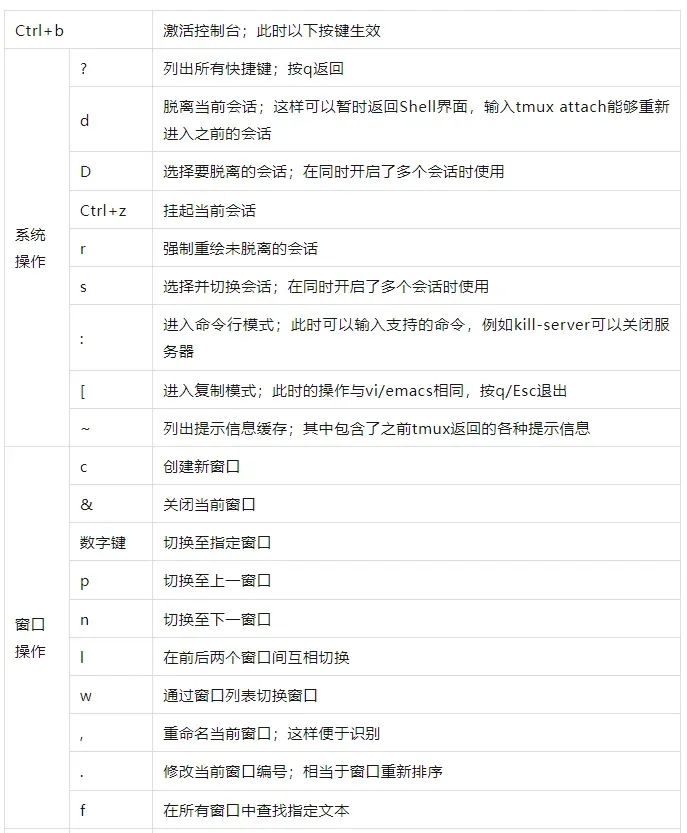

## 让 wsl 不要继承 Windows 的环境变量

默认的 wsl 版本会继承 Windows 的环境变量，导致 wsl 无法正常工作。输入以下命令：

```bash
echo $PATH
```

可以看到，环境变量中有 Windows 的路径。

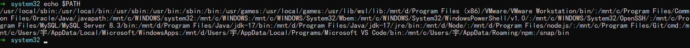

为了让 wsl 环境变量不继承 Windows 的环境变量，需要修改 wsl 的配置文件。

```bash
sudo vi /etc/wsl.conf
```

添加下面这一行到文件末尾：

```bash
[interop]
appendWindowsPath=false
```

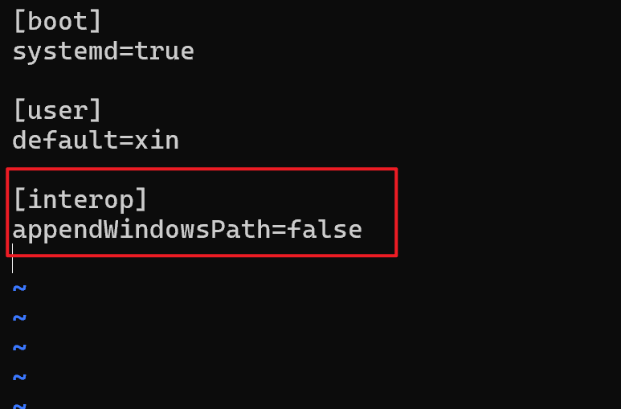

然后重启 wsl 让配置生效。

打开 cmd，输入以下命令：

```bash
wsl --shutdown
```

关闭 wsl 后，再重新打开 wsl，输入以下命令：

```bash
echo $PATH
```

可以看到，环境变量中没有 Windows 的路径。


对上述方案修改不生效的，可以编辑~/.zshrc 文件`vi ~/.zshrc`

在文件的`export PATH=`语句后面添加以下内容：

```
# 将~/bin加入到PATH环境变量中
export PATH=$HOME/bin:/usr/local/bin:$PATH

# 删除Windows环境变量
export PATH=`echo $PATH | tr ':' '\n' | grep -v /mnt/ | tr '\n' ':'`
```

这样，每次打开 wsl 时，都会重新生成环境变量，并删除掉 Windows 的路径。

## 安装 Docker Desktop For Windows

首先，下载并安装 [Docker Desktop For Windows](https://www.docker.com/products/docker-desktop/)

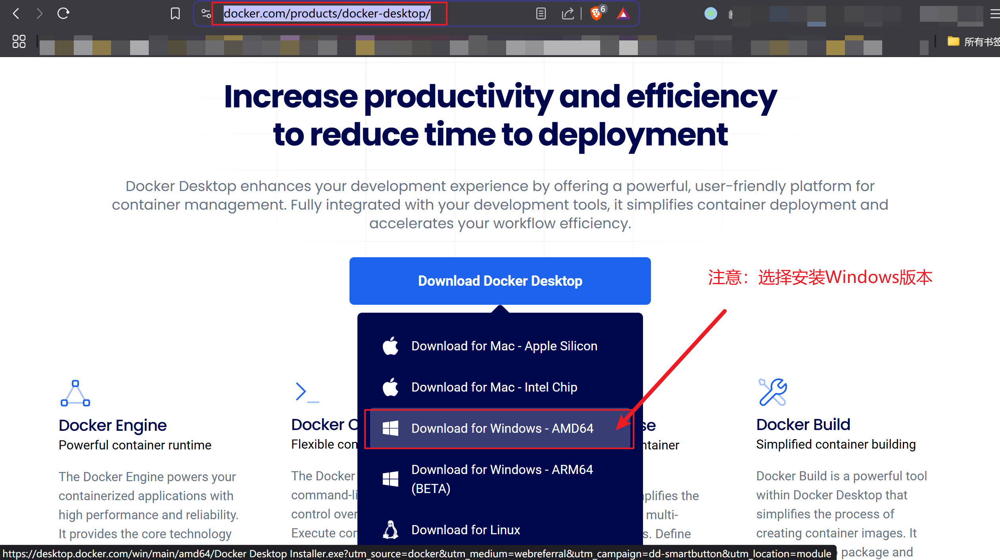

Docker Desktop For Windows 依赖于 WSL（前面已经安装并更新 wsl）。

安装过程中可能需要重启系统。

## 配置 Docker 并启用 WSL 集成

安装完成后，进入 docker desktop，打开设置中的 Ubuntu Integration，应用并重启 docker 服务。

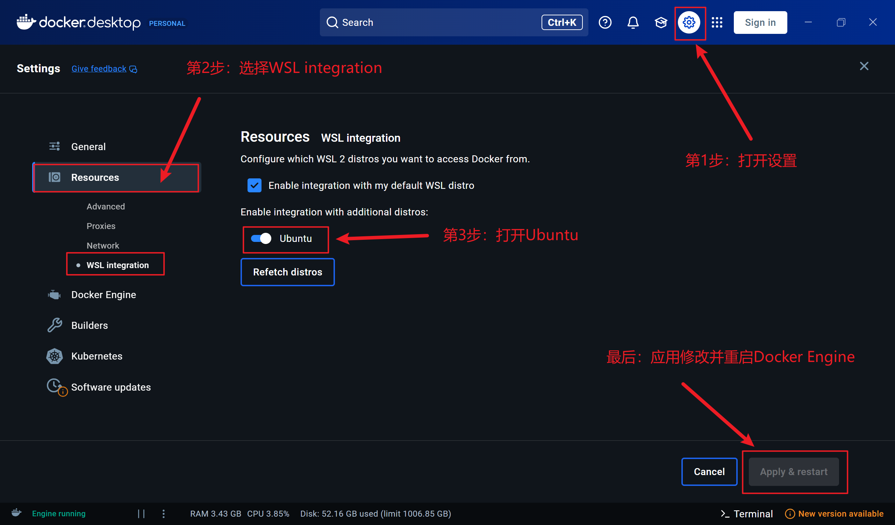

在 wsl 中输入以下命令验证已经可以访问 docker 服务：

```bash
docker ps
docker run -d -p 8080:80 docker/welcome-to-docker
```

如果报错，可能是因为当前用户没有访问`/var/run/docker.sock`文件的权限，需要给当前用户授权，把用户加入 docker 组即可：

```bash
sudo usermod -aG docker $USER
```

浏览器中打开 http://localhost:8080 ，可以看到 docker 的欢迎页面，说明 docker 已经正常运行。


## 配置 docker 镜像仓库地址

如果拉不到镜像，说明运营商把 docker 仓库给屏蔽了，可以配置 docker 镜像仓库：

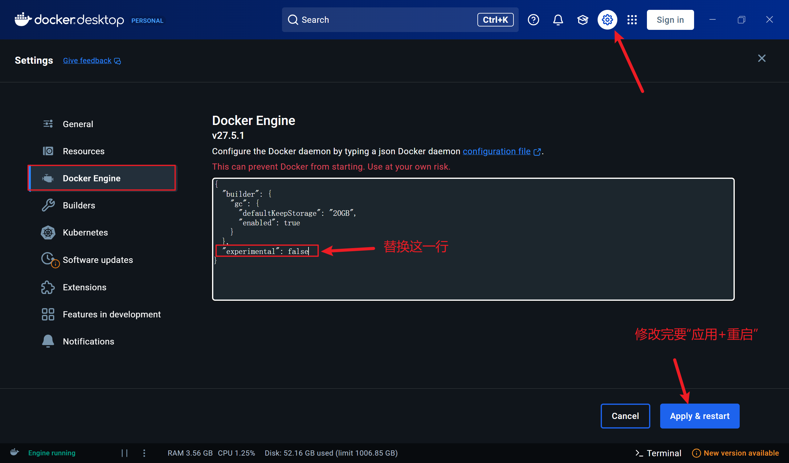

将配置中的：`"experimental": false`

替换为以下代码：

```
  "experimental": false,
  "registry-mirrors": [
    "https://docker.1ms.run",
    "https://docker.mybacc.com",
    "https://dytt.online",
    "https://lispy.org",
    "https://docker.xiaogenban1993.com",
    "https://docker.yomansunter.com",
    "https://aicarbon.xyz",
    "https://666860.xyz",
    "https://docker.zhai.cm",
    "https://a.ussh.net",
    "https://hub.littlediary.cn",
    "https://hub.rat.dev",
    "https://docker.m.daocloud.io"
  ]
```

修改后配置为：


应用修改以后，要重启 docker 服务。

最后，welcome-to-docker 应用运行成功后，可以通过`docker ps`和`docker stop`命令可以关闭上面的 welcome-to-docker 容器应用
。

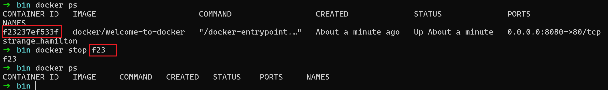

## 在~/bin 路径创建指向 windows 程序的软链接

这里以 vscode 和 cursor 程序为例，其他程序的创建方法类似。

确定 windows 中 vscode 与 cursor 程序的安装路径，在 wsl 中输入以下命令创建指向它们的软链接：


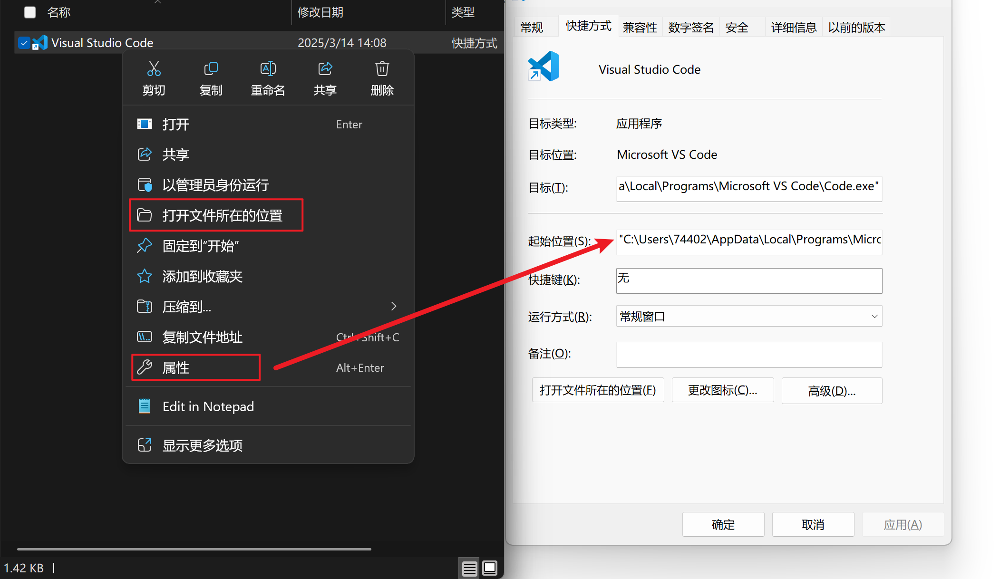

Windows 下的路径`C:\`，在 wsl 中用`/mnt/c`表示，所以可以用以下命令创建指向 Windows 中 vscode 和 cursor 应用程序的软链接
：

找到程序的 windows 路径以后，就可以使用`wslpath`命令将 windows 路径转换为 wsl 路径：

```bash
# 比如：
wslpath "C:\Users\74402\AppData\Local\Programs\Microsoft VS Code\Code.exe"

# 输出：
/mnt/c/Users/74402/AppData/Local/Programs/Microsoft VS Code/Code.exe
```

就可以用 输出的 wsl 路径来创建软链接了。

```bash
# 创建bin目录
mkdir -p ~/bin

# 创建指向 vscode 和cursor程序的软链接
ln -s /mnt/c/Users/你的用户名/AppData/Local/Programs/Microsoft\ VS\ Code/bin/code ~/bin/code
ln -s /mnt/c/Users/你的用户名/AppData/Local/Programs/Cursor/cursor.exe ~/bin/cursor
```

<Callout emoji="ℹ️">
注意：使用斜杠`\`对 Windows 中路径中可能存在的空格字符进行转义。
</Callout>

使用上面创建好的软链接文件`code`和`cursor`，就可以在 wsl 中通过`code`和`cursor`命令打开 vscode 和 cursor 程序了。

## 安装 nodejs LTS 以及 pnpm

首先，安装 node.js 版本管理工具：[nvm](https://github.com/nvm-sh/nvm?tab=readme-ov-file#installing-and-updating)：

```bash
curl -o- https://raw.githubusercontent.com/nvm-sh/nvm/v0.40.2/install.sh | bash
```

<Callout emoji="✅">
注意：安装完成nvm以后，要重启命令行窗口或者执行`source ~/.zshrc`命令，否则nvm命令无法生效。
</Callout>

然后，安装 nodejs LTS 版本：

```bash
nvm install node
node --version
```

配置 npm 源，使用淘宝镜像：

```bash
# 回到用户主目录
cd
# 创建.npmrc 文件，配置 npm 源
npm config set registry https://registry.npmmirror.com
```

安装现代 node.js 的包管理工具：pnpm

```bash
# 安装 pnpm
npm install -g pnpm

# 查看 pnpm 版本
pnpm --version
```

## 运行第一个 Next.js 项目

```bash
# 创建next.js项目，名称为：my-app
npx create-next-app@latest my-app --use-pnpm
```

选择以下选项：

```bash
Need to install the following packages:
create-next-app@15.2.4
Ok to proceed? (y)

Would you like to use TypeScript?  Yes
Would you like to use ESLint?  No
Would you like to use Tailwind CSS?  Yes
Would you like your code inside a `src/` directory? Yes
Would you like to use App Router? (recommended)  Yes
Would you like to use Turbopack for `next dev`?  Yes
Would you like to customize the import alias (`@/*` by default)? No
```

安装完依赖后，运行项目：

```bash
# 进入项目目录
cd my-app
# 启动开发服务器
pnpm dev
```

浏览器中打开 `http://localhost:3000` ，可以看到 Next.js 的欢迎页面。

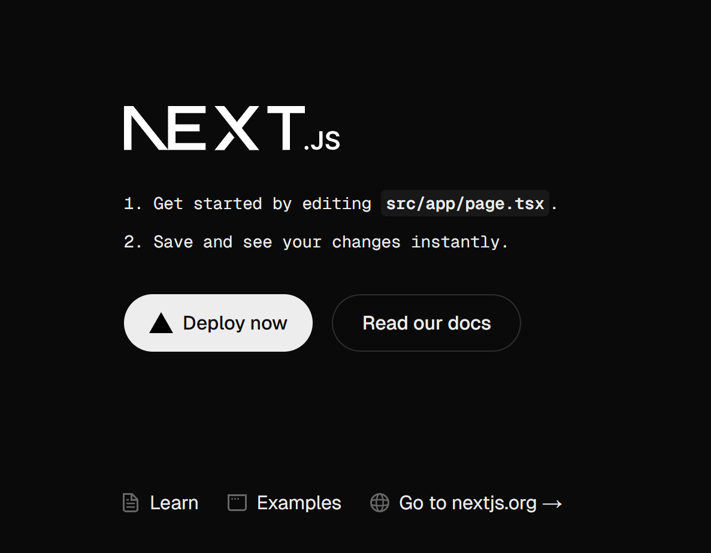

next.js 的应用，在某些系统上如果使用 next dev --turbopack 启动，会报下面的错误：

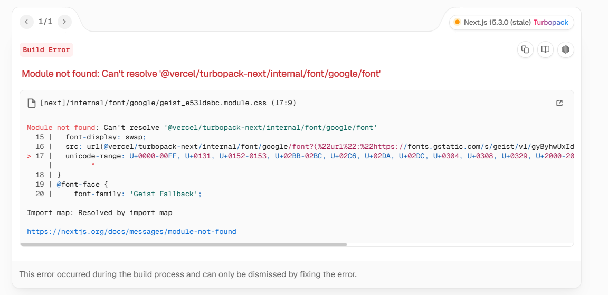

```bash
Module not found: Can't resolve '@vercel/turbopack-next/internal/font/google/font'
```

这个错误是因为在使用 next dev --turbopack 时，Turbopack 对 @next/font（或 @vercel/turbopack-next 内部字体处理）的支持尚
未完全稳定或存在路径解析问题。以下是解决方案：

编辑项目目录下的`package.json`文件，建议在开发阶段暂时不使用 --turbopack，直到官方提供更稳定的支持。

```json
...
"scripts": {
    "dev": "next dev --turbopack", // 这里把 --turbopack 选项删除掉
    "build": "next build",
    "start": "next start",
    "lint": "next lint"
},
...
```

参考资源：

-   https://nextjs.org/docs/getting-started
-   https://nextjs.org/docs/app/api-reference/cli/create-next-app

## 安装配置 aws-cli

安装下载工具 curl 与解压缩工具 unzip：

```bash
sudo apt-get update
sudo apt-get install curl unzip
```

安装 AWS CLI V2：

```bash
curl "https://awscli.amazonaws.com/awscli-exe-linux-x86_64.zip" -o "awscliv2.zip"
unzip awscliv2.zip
sudo ./aws/install
```

验证 aws-cli 是否安装成功：

```bash
aws --version
aws-cli/2.25.6 Python/3.12.9 Linux/5.15.167.4-microsoft-standard-WSL2 exe/x86_64.ubuntu.24
```

配置 aws-cli：

```bash
vi ~/.aws/config
```

输入以下信息：

```
[default]
region = us-east-1
output = json

[profile localstack]
output = json
endpoint_url = http://localhost:4566
region = us-east-1
```

```bash
vi ~/.aws/credentials
```

输入以下信息：

```
[default]
aws_access_key_id=[your access key id here]
aws_secret_access_key=[your secret access key here]

[localstack]
aws_access_key_id=test
aws_secret_access_key=test
```

参考资源：

-   https://docs.aws.amazon.com/cli/latest/userguide/getting-started-install.html

## 安装 localstack

下载安装包：

```bash
curl --output localstack-cli-4.3.0-linux-amd64-onefile.tar.gz \
    --location https://github.com/localstack/localstack-cli/releases/download/v4.3.0/localstack-cli-4.3.0-linux-amd64-onefile.tar.gz
```

解压安装：

```bash
sudo tar xvzf localstack-cli-4.3.0-linux-*-onefile.tar.gz -C /usr/local/bin
```

验证 localstack 是否安装成功：

```bash
localstack --version
LocalStack CLI 4.3.0
```

先启动 Docker 服务，再启动 localstack 服务:

```bash
# 默认localstack不会保存数据，重启后所有数据消失
localstack start
```

<Callout emoji="✅">
注意：保存数据仅仅在localstack pro版本中提供，免费的社区版本中不提供，服务重启以后数据也会消失。

登录 localstack 控制台，获取 token，并设置环境变量。

只有当检测到下面这个环境变量才会使用 pro 服务： export LOCALSTACK_AUTH_TOKEN="\***\* put your token here \*\***"

只有当下面这个环境变量设置为 1 时，才会保存数据： export PERSISTENCE=1 </Callout>

配置 awslocal 命令，使用 aws-cli 访问本地 localstack：

```bash
vi ~/.zshrc
```

输入以下信息：

```bash
# 增加 awslocal 命令，使用 aws-cli 访问本地 localstack
alias awslocal="aws --profile=localstack"
```

在第一个终端中启动 Localstack 服务，并保持运行：

```bash
localstack start
```

开启第二个终端，在其中运行 awslocal 命令，测试 localstack 服务与 awslocal 客户端是否配置成功：

```bash
# 创建一个 test bucket
awslocal s3 mb s3://test
# 列出所有 bucket
awslocal s3 ls
# 删除 test bucket
awslocal s3 rb s3://test
```

参考：

-   https://docs.localstack.cloud/getting-started/installation/

## 安装 terraform

```bash
wget -O - https://apt.releases.hashicorp.com/gpg | sudo gpg --dearmor -o /usr/share/keyrings/hashicorp-archive-keyring.gpg
echo "deb [arch=$(dpkg --print-architecture) signed-by=/usr/share/keyrings/hashicorp-archive-keyring.gpg] https://apt.releases.hashicorp.com $(lsb_release -cs) main" | sudo tee /etc/apt/sources.list.d/hashicorp.list
sudo apt update && sudo apt install terraform
```

参考：

-   https://developer.hashicorp.com/terraform/install?product_intent=terraform

## 获取项目源代码

-   Gitee: https://gitee.com/sanyedu/portal-site
-   Github: https://github.com/sanyedu/portal-site

获取到源代码后，运行以下命令：

```bash
# 进入项目目录
cd portal-site

# 安装项目依赖
pnpm install
```

## 初始化 localstack 环境

运行以下命令，安装 GNU-Make 和 Python virtualenv：

```bash
sudo apt install make python3-venv
```

<Callout emoji="✅">
注意：需要事先获取`.env.local`文件，在文件中正确的配置环境变量

将`.env.local`文件放入项目源代码的根目录中。

由于这个配置文件中包含密钥信息，所以没有放在代码仓库中。 </Callout>

运行项目中的 Makefile 脚本，在 localstack 环境中创建 DynamoDB 表和 s3 bucket：

先开一个终端窗口，启动 localstack 服务（确保 Docker 服务已经启动）：

```bash
make localstack
```

再开一个终端窗口，初始化 Terraform 环境并创建 DynamoDB 表和 s3 bucket 资源：

```bash
# 初始化 tflocal 和 terraform
make localstack-tf-init

# 创建 DynamoDB 表和 s3 bucket
make localstack-tf-setup

# 查看在localstack中创建好的资源
make localstack-show
```

初始化完成后，在第一个终端窗口中按 `Ctrl+C` 停止 localstack 服务。

## 启动开发服务器

```bash
pnpm dev
```

打开浏览器访问： `http://localhost:3000`

# Shell 教程

## 什么是 Shell？

Shell 是一个用 C 语言编写的程序，它是用户使用 Linux 的桥梁。Shell 既是一种命令语言，又是一种程序设计语言。

Shell 是指一种应用程序，这个应用程序提供了一个界面，用户通过这个界面访问操作系统内核的服务。

Ken Thompson 的 sh 是第一种 Unix Shell，Windows Explorer 是一个典型的图形界面 Shell。

## Shell 脚本

Shell 脚本（shell script），是一种为 shell 编写的脚本程序。

业界所说的 shell 通常都是指 shell 脚本，但读者朋友要知道，shell 和 shell script 是两个不同的概念。

由于习惯的原因，简洁起见，本文出现的 "shell 编程" 都是指 shell 脚本编程，不是指开发 shell 自身。

## Shell 环境

Shell 编程跟 JavaScript、php 编程一样，只要有一个能编写代码的文本编辑器和一个能解释执行的脚本解释器就可以了。

Linux 的 Shell 种类众多，常见的有：

-   Bourne Shell（/usr/bin/sh 或/bin/sh）
-   Bourne Again Shell（/bin/bash）
-   C Shell（/usr/bin/csh）
-   K Shell（/usr/bin/ksh）
-   Shell for Root（/sbin/sh）
-   ……
-   Z Shell（/usr/bin/zsh）

本教程关注的是 Bash，也就是 Bourne Again Shell，由于易用和免费，Bash 在日常工作中被广泛使用。同时，Bash 也是大多数 Linux
系统默认的 Shell。

在一般情况下，人们并不区分 Bourne Shell 和 Bourne Again Shell，所以，像 #!/bin/sh，它同样也可以改为 #!/bin/bash。

#! 告诉系统其后路径所指定的程序即是解释此脚本文件的 Shell 程序。

## 第一个 shell 脚本

打开文本编辑器(可以使用 vi/vim 命令来创建文件)，新建一个文件 test.sh，扩展名为 sh（sh 代表 shell），扩展名并不影响脚本执
行，见名知意就好，如果你用 php 写 shell 脚本，扩展名就用 php 好了。

输入一些代码，第一行一般是这样：

```bash
#!/bin/bash
echo "Hello World !"
```

`#!` 是一个约定的标记，它告诉系统这个脚本需要什么解释器来执行，即使用哪一种 Shell。

echo 命令用于向窗口输出文本。

运行 Shell 脚本有两种方法：

1、作为可执行程序

将上面的代码保存为 test.sh，并 cd 到相应目录：

```bash
chmod +x ./test.sh  #使脚本具有执行权限
./test.sh  #执行脚本
```

注意，一定要写成 ./test.sh，而不是 test.sh，运行其它二进制的程序也一样，直接写 test.sh，linux 系统会去 PATH 里寻找有没有
叫 test.sh 的，而只有 /bin, /sbin, /usr/bin，/usr/sbin 等在 PATH 里，你的当前目录通常不在 PATH 里，所以写成 test.sh 是会
找不到命令的，要用 ./test.sh 告诉系统说，就在当前目录找。

2、作为解释器参数

这种运行方式是，直接运行解释器，其参数就是 shell 脚本的文件名，如：

```bash
sh test.sh
zsh test.sh
```

这种方式运行的脚本，不需要在第一行指定解释器信息，写了也没用。

## Shell 变量

在 Shell 编程中，变量是用于存储数据值的名称。

定义变量时，变量名不加美元符号`$`，如：

`your_name="runoob"`

注意，变量名和等号之间不能有空格，这可能和你熟悉的所有编程语言都不一样。同时，变量名的命名须遵循如下规则：

只包含字母、数字和下划线： 变量名可以包含字母（大小写敏感）、数字和下划线，不能包含其他特殊字符。不能以数字开头： 变量名
不能以数字开头，但可以包含数字。

避免使用 Shell 关键字： 不要使用 Shell 的关键字（例如 if、then、else、fi、for、while 等）作为变量名，以免引起混淆。

使用大写字母表示常量： 习惯上，常量的变量名通常使用大写字母，例如 `PI=3.14` 避免使用特殊符号： 尽量避免在变量名中使用特
殊符号，因为它们可能与 Shell 的语法产生冲突。避免使用空格： 变量名中不应该包含空格，因为空格通常用于分隔命令和参数。有效
的 Shell 变量名示例如下：

```bash
RUNOOB="www.runoob.com"
LD_LIBRARY_PATH="/bin/"
_var="123"
var2="abc"
```

无效的变量命名：

```bash
# 不能以数字开头
# 避免使用if作为变量名
if="some_value"
# 避免使用 $ 等特殊符号
variable_with_$=42
?var=123
user*name=runoob
# 避免空格
variable with space="value"
```

等号两侧避免使用空格：

```bash
# 正确的赋值
variable_name=value

# 有可能会导致错误
variable_name = value
```

除了显式地直接赋值，还可以用语句给变量赋值，如：

```bash
for file in `ls /etc`
# 或者
for file in $(ls /etc)
```

以上语句将 `/etc` 下目录的文件名循环出来。

使用变量使用一个定义过的变量，只要在变量名前面加美元符号即可，如：

实例

```bash
your_name="qinjx"
echo $your_name
echo ${your_name}
```

变量名外面的花括号是可选的，加不加都行，加花括号是为了帮助解释器识别变量的边界，比如下面这种情况：

实例

```bash
for skill in Ada Coffe Action Java; do
    echo "I am good at ${skill}Script"
done
```

如果不给 skill 变量加花括号，写成 `echo "I am good at $skillScript"`，解释器就会把`$skillScript` 当成一个变量（其值为空
），代码执行结果就不是我们期望的样子了。

推荐给所有变量加上花括号，这是个好的编程习惯。

已定义的变量，可以被重新定义，如：

实例

```bash
your_name="tom"
echo $your_name
your_name="alibaba"
echo $your_name
```

这样写是合法的，但注意，第二次赋值的时候不能写`$your_name="alibaba"`，使用变量的时候才加美元符（$）。

只读变量使用 `readonly` 命令可以将变量定义为只读变量，只读变量的值不能被改变。

下面的例子尝试更改只读变量，结果报错：

实例

```bash
#!/bin/bash

myUrl="https://www.google.com"
readonly myUrl
myUrl="https://www.runoob.com"
```

运行脚本，结果如下：

`/bin/sh: NAME: This variable is read only.`

删除变量使用 unset 命令可以删除变量。语法：

`unset variable_name`

变量被删除后不能再次使用。unset 命令不能删除只读变量。

实例

```bash
#!/bin/sh

myUrl="https://www.runoob.com"
unset myUrl
echo $myUrl
```

以上实例执行将没有任何输出。

变量类型 Shell 支持不同类型的变量，其中一些主要的类型包括：

字符串变量： 在 Shell 中，变量通常被视为字符串。

你可以使用单引号 ' 或双引号 " 来定义字符串，例如：

`my_string='Hello, World!'`

或者

`my_string="Hello, World!"` 整数变量： 在一些 Shell 中，你可以使用 declare 或 typeset 命令来声明整数变量。

这样的变量只包含整数值，例如：

`declare -i my_integer=42`

这样的声明告诉 Shell 将 my_integer 视为整数，如果尝试将非整数值赋给它，Shell 会尝试将其转换为整数。

数组变量： Shell 也支持数组，允许你在一个变量中存储多个值。

数组可以是整数索引数组或关联数组，以下是一个简单的整数索引数组的例子：

`my_array=(1 2 3 4 5)`

或者关联数组：

```bash
declare -A associative_array
associative_array["name"]="John"
associative_array["age"]=30
```

环境变量： 这些是由操作系统或用户设置的特殊变量，用于配置 Shell 的行为和影响其执行环境。

例如，PATH 变量包含了操作系统搜索可执行文件的路径：

`echo $PATH`

特殊变量： 有一些特殊变量在 Shell 中具有特殊含义，例如 `$0` 表示脚本的名称，`$1`, `$2`, 等表示脚本的参数。

`$#`表示传递给脚本的参数数量，`$?` 表示上一个命令的退出状态等。

Shell 字符串

字符串是 shell 编程中最常用最有用的数据类型（除了数字和字符串，也没啥其它类型好用了），字符串可以用单引号，也可以用双引
号，也可以不用引号。

单引号 `str='this is a string'`

单引号字符串的限制：

-   单引号里的任何字符都会原样输出，单引号字符串中的变量是无效的；
-   单引号字符串中不能出现单独一个的单引号（对单引号使用转义符后也不行），但可成对出现，作为字符串拼接使用。
-   双引号

实例

```bash
your_name="runoob"
str="Hello, I know you are \"$your_name\"! \n"
echo -e $str
```

输出结果为：

`Hello, I know you are "runoob"!`

双引号的优点：

-   双引号里可以有变量
-   双引号里可以出现转义字符
-   拼接字符串

实例

`your_name="runoob"`

使用双引号拼接

```bash
greeting="hello, "$your_name" !"
greeting_1="hello, ${your_name} !"
echo $greeting $greeting_1
```

使用单引号拼接

```bash
greeting_2='hello, '$your_name' !'
greeting_3='hello, ${your_name} !'
echo $greeting_2 $greeting_3
```

输出结果为：

```bash
hello, runoob ! hello, runoob !
hello, runoob ! hello, ${your_name} !
```

获取字符串长度

实例

```bash
string="abcd"
echo ${#string}   # 输出 4
```

变量为字符串时，`${#string}` 等价于 `${#string[0]}`:

实例

```bash
string="abcd"
echo ${#string[0]} # 输出 4
```

提取子字符串以下实例从字符串第 2 个字符开始截取 4 个字符：

实例

```bash
string="runoob is a great site"
echo ${string:1:4} # 输出 unoo
```

注意：第一个字符的索引值为 0。

查找子字符串查找字符 i 或 o 的位置(哪个字母先出现就计算哪个)：

实例

```bash
string="runoob is a great site"
echo `expr index "$string" io` # 输出 4
```

注意： 以上脚本中是反引号，而不是单引号，不要看错了哦。

Shell 数组 bash 支持一维数组（不支持多维数组），并且没有限定数组的大小。

类似于 C 语言，数组元素的下标由 0 开始编号。获取数组中的元素要利用下标，下标可以是整数或算术表达式，其值应大于或等于 0。

定义数组在 Shell 中，用括号来表示数组，数组元素用"空格"符号分割开。定义数组的一般形式为：

数组名=(值 1 值 2 ... 值 n) 例如：

`array_name=(value0 value1 value2 value3)` 或者

```bash
array_name=(
value0
value1
value2
value3
)
```

还可以单独定义数组的各个分量：

```bash
array_name[0]=value0
array_name[1]=value1
array_name[n]=valuen
```

可以不使用连续的下标，而且下标的范围没有限制。

读取数组读取数组元素值的一般格式是：

`${数组名[下标]}` 例如：

`valuen=${array_name[n]}` 使用 @ 符号可以获取数组中的所有元素，例如：

`echo ${array_name[@]}` 获取数组的长度获取数组长度的方法与获取字符串长度的方法相同，例如：

实例

取得数组元素的个数

```bash
length=${#array_name[@]}

# 或者

length=${#array_name[*]}

# 取得数组单个元素的长度

length=${#array_name[n]}
```

## Shell 注释

以 # 开头的行就是注释，会被解释器忽略。

通过每一行加一个 # 号设置多行注释，像这样：

实例

```bash
#--------------------------------------------
##### 用户配置区 开始
#
#
# 这里可以添加脚本描述信息
#
#
##### 用户配置区 结束
#--------------------------------------------
```

如果在开发过程中，遇到大段的代码需要临时注释起来，过一会儿又取消注释，怎么办呢？

每一行加个#符号太费力了，可以把这一段要注释的代码用一对花括号括起来，定义成一个函数，没有地方调用这个函数，这块代码就不
会执行，达到了和注释一样的效果。

多行注释使用 Here 文档

多行注释还可以使用以下格式：

```bash
:<<EOF
注释内容...
注释内容...
注释内容...
EOF
```

以上例子中，: 是一个空命令，用于执行后面的 Here 文档，`<<'EOF'` 表示开启 Here 文档，COMMENT 是 Here 文档的标识符，在这两
个标识符之间的内容都会被视为注释，不会被执行。 EOF 也可以使用其他符号:

实例

```bash
: <<'COMMENT'
这是注释的部分。
可以有多行内容。
COMMENT

:<<'
注释内容...
注释内容...
注释内容...
'

:<<!
注释内容...
注释内容...
注释内容...
!
```

直接使用 : 号

我们也可以使用了冒号 : 命令，并用单引号 ' 将多行内容括起来。由于冒号是一个空命令，这些内容不会被执行。

格式为：: + 空格 + 单引号。

实例

```bash
: '
这是注释的部分。
可以有多行内容。
'
```
